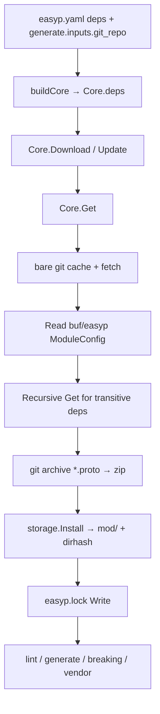

# EasyP Dependency Management

Agent-oriented specification of how EasyP declares, downloads, locks, and resolves protobuf dependencies.

Source of truth: Go code under `internal/core`, `internal/api`, and `internal/adapters`. Do not treat human docs or skill references as authoritative when they disagree with this file or the code.

---

## 1. Overview

EasyP’s package manager is **Git-native** and shaped like Go modules:

- Any Git repository path can be a dependency (no Buf Schema Registry).
- Versions are Git tags, branch names, commit hashes, omitted (`HEAD`), or Go-style pseudo-versions.
- Installs are cached under `EASYPPATH` (default `$HOME/.easyp`).
- Reproducibility is provided by project-root `easyp.lock`.
- Auth, proxies, and SSH are delegated to the system `git` CLI (no remotes/mirrors/tokens in `easyp.yaml`).

Vendor output directory is hardcoded as `easyp_vendor` (not `vendor/`).

---

## 2. Declaration (`easyp.yaml`)

### `deps`

```yaml
deps:
  - github.com/googleapis/googleapis@common-protos-1_3_1
  - github.com/bufbuild/protoc-gen-validate          # version omitted → latest
```

| Field | Go type | Notes |
|-------|---------|--------|
| `deps` | `[]string` | `Config.Deps` in `internal/config/config.go` |
| Entry format | `repo[@version]` | Split on first `@` via `models.NewModule` |
| Omitted version | `RequestedVersion("")` | Treated as latest (`HEAD`) |

Entire config content (including deps) is expanded with `envsubst` (`${VAR}`) before YAML parse.

### Union with generate inputs

`buildCore` builds the effective deps list as:

```
uniq(cfg.Deps + generate.inputs[].git_repo.url)
```

See `getDepsFromGenerateDeps` in `internal/api/mod.go` and `buildCore` in `internal/api/temporaly_helper.go`.

```yaml
generate:
  inputs:
    - git_repo:
        url: github.com/acme/contracts@v1.2.3   # also becomes a Core.deps entry
        sub_directory: proto
```

There are **no** YAML fields for remotes, mirrors, auth, cache path, lockfile path, or vendor dir.

---

## 3. CLI

Parent command: `easyp mod` (alias `m`) — `internal/api/mod.go`.

| Subcommand | Core method | Behavior |
|------------|-------------|----------|
| `mod download` | `Core.Download` | Lock-first install; empty lock → `Update` |
| `mod update` | `Core.Update` | Install every config dep; refresh lock |
| `mod vendor` | `Core.Vendor` | `Download`, then copy install trees → `easyp_vendor` |

No subcommand-specific flags.

### Global flags (all commands)

| Flag | Env | Default |
|------|-----|---------|
| `--cfg` / `--config` | `EASYP_CFG` | `easyp.yaml` |
| `--debug` / `-d` | `EASYP_DEBUG` | `false` |
| `--format` / `-f` | `EASYP_FORMAT` | `text` |

### Exit codes

On `models.ErrVersionNotFound`, mod handlers call `os.Exit(1)`.

---

## 4. Flows



### `Download` (`internal/core/download.go`)

1. If lockfile is empty / missing → delegate to `Update`.
2. Else install each lockfile entry via `Get`.
3. Then install any `c.deps` entries not already in the lockfile.

### `Update` (`internal/core/update.go`)

For each string in `c.deps`, parse `Module` and call `Get` (overwrites lock entries with resolved revision + hash).

### `Get` / `get` (`internal/core/get.go`)

**Fast path:** if `.info` exists for the requested module/version and hash checks pass → skip network; still rewrite lock entry.

**Install path (`get`):**

1. `storage.CreateCacheRepositoryDir(name)` — bare clone under `cache/<sha256(name)>`
2. `git.New` — `origin` = `https://` + module name
3. `repo.ReadRevision` — resolve tag / branch / commit / HEAD / pseudo-version
4. `repo.Fetch` — shallow fetch
5. `moduleConfig.ReadFromRepo` — buf or easyp module layout + transitive deps
6. Recursive `Get` for each `moduleConfig.Dependencies`
7. `repo.Archive` — `git archive --format=zip <commit> -o … "*.proto"` only
8. `storage.Install` — extract, strip module dirs, `dirhash.HashDir`, atomic rename into `mod/`
9. Write `.info` + `lockFile.Write`

### `Vendor` (`internal/core/vendor.go`)

1. `Download`
2. For each lock entry, `cp.Copy(installDir, vendorDir)` where `vendorDir` is `easyp_vendor`

---

## 5. Lockfile (`easyp.lock`)

| Property | Value |
|----------|--------|
| Filename | `easyp.lock` (constant `lockFileName`) |
| Location | Project working directory (via `DirWalker`) |
| Line format | `moduleName version hash` (exactly 3 space-separated fields) |
| Hash | Go `dirhash` style (`h1:…`) of installed tree |
| Write behavior | Full rewrite; keys sorted alphabetically |

Example:

```
github.com/googleapis/googleapis v0.0.0-20250909114430-8727b5baabcdef h1:eI+…
github.com/grpc-ecosystem/grpc-gateway v2.19.1 h1:01NNlC…
```

Malformed lines (≠ 3 fields) are skipped on read.

Key types: `models.LockFileInfo`, `models.ErrModuleNotFoundInLockFile` (`internal/core/models/lock_file_info.go`).

Adapter: `internal/adapters/lock_file/`.

---

## 6. Storage layout (`EASYPPATH`)

| Env | Default |
|-----|---------|
| `EASYPPATH` | `$HOME/.easyp` |

```
$EASYPPATH/
├── cache/
│   ├── download/<moduleName>/<sanitizedVersion>.zip
│   ├── download/<moduleName>/<sanitizedVersion>.info   # JSON InstalledModuleInfo
│   └── <sha256(moduleName)>/                          # bare git repository
└── mod/<moduleName>/<sanitizedVersion>/               # extracted *.proto tree
```

- `sanitizePath`: replaces `/` with `-` in version strings.
- Install example: `~/.easyp/mod/github.com/googleapis/googleapis/v1.2.3`
- Archive contains only `*.proto` files.
- If remote has `buf.work.yaml` / `buf.yaml` / `easyp.yaml` directories, install strips those prefixes so import paths match.

Adapter: `internal/adapters/storage/`.

---

## 7. Version resolution

`repo.ReadRevision` (`internal/adapters/repository/git/read_revision.go`):

| Requested version | Resolution |
|-------------------|------------|
| Pseudo-version `v0.0.0-<datetime>-<commit>` | Fetch that commit |
| Omitted | `HEAD` → tag if present, else generate pseudo-version |
| Explicit | tag → branch → commit hash (in that order) |

Pseudo-version format mirrors Go modules: `v0.0.0-20240222234643-814bf88cf225`.

Helpers: `RequestedVersion.IsGenerated()`, `IsOmitted()`, `GetParts()` in `internal/core/models/module.go`.

Remote URL construction: always `https://` + module path (`getRemote` in `internal/adapters/repository/git/git.go`). No SSH URLs in deps strings.

---

## 8. Transitive / module config

`ModuleConfig.ReadFromRepo` (`internal/adapters/module_config/read_from_repo.go`) tries, in order:

1. **Buf** (`buf.work.yaml` v1 or `buf.yaml` v2) → **directories only** (no dependency list)
2. **EasyP** (`easyp.yaml`) → `deps` become transitive `Dependencies`; `generate.inputs[].input_files_dir.root` become `Directories`
3. Else empty config

Indirect deps are installed only when the remote module ships an `easyp.yaml` with `deps`. Buf-only modules do not pull transitive packages via EasyP.

---

## 9. Consumers (auto-download)

| Command | Calls `Download`? | Dep usage |
|---------|-------------------|-----------|
| `lint` | yes (`internal/core/lint.go`) | Import resolution via install dirs |
| `generate` | yes (`internal/core/generate.go`) | Install dirs on import path; walks `git_repo` inputs |
| `breaking` | yes (`internal/core/breaking_check.go`) | Same import resolution path |
| `mod vendor` | via `Download` | Copies install trees |
| `ls-files` | **no** | Uses lock + install dirs if present |

### Import resolution order (`readFileFromImport`)

1. Local project file
2. Each `c.deps` module’s `GetInstallDir` (via lock version)
3. Embedded well-known types (`wellknownimports`)

---

## 10. Auth and private repos

No auth fields in `easyp.yaml`. Fetch always uses HTTPS + system `git`.

Documented operational patterns (outside code):

- SSH: `git config url."git@host:.insteadOf" "https://host/"`
- Tokens: credential helper / URL rewrite
- Corporate CA / proxy: standard git / HTTP env

`generate.plugins[].remote` is **remote plugin execution** (gRPC), not proto dependency remotes.

---

## 11. Key packages and types

| Package / type | Role |
|----------------|------|
| `internal/api.Mod` | CLI wiring for `mod` |
| `internal/api.buildCore` | Assembles deps, storage, lock, vendor dir |
| `core.Core` | `Download`, `Update`, `Get`, `Vendor` |
| `core.Storage` | Cache dirs, install, hashes, install paths |
| `core.LockFile` | Read / Write / IsEmpty / DepsIter |
| `core.ModuleConfig` | Read buf/easyp layout from cloned repo |
| `models.Module` | Name + `RequestedVersion` |
| `models.LockFileInfo` | Name, version, hash |
| `models.InstalledModuleInfo` | Name, hash, revision version (`.info` file) |
| `models.Revision` | CommitHash + Version |
| `models.ModuleConfig` | `Dependencies` + `Directories` |
| `adapters/repository/git` | Bare clone, fetch, archive, revision resolve |
| `adapters/lock_file` | `easyp.lock` I/O |
| `adapters/storage` | `$EASYPPATH` layout |
| `adapters/module_config` | Buf / EasyP module config readers |

### Domain errors (`internal/core/models`)

| Error | Meaning |
|-------|---------|
| `ErrVersionNotFound` | Tag/branch/commit could not be resolved |
| `ErrHashDependencyMismatch` | Lock hash ≠ installed tree hash |
| `ErrModuleNotFoundInLockFile` | Module missing from lock |
| `ErrModuleInfoFileNotFound` | No `.info` → need install |
| `ErrModuleNotInstalled` | Install dir missing |
| `ErrFileNotFound` | Module config file missing in repo |

---

## 12. Agent rules

- Prefer this spec + code over outdated docs/skills that say vendor → `vendor/` (actual: `easyp_vendor`).
- Do not invent remotes, mirrors, or auth YAML fields; they do not exist.
- Do not hand-edit generated `schemas/*.json` for deps schema changes — update `mcp/easypconfig` / `internal/config`, then `task schema:generate`.
- Commit `easyp.lock` for reproducible CI; cache lives outside the repo (`EASYPPATH`).
- `mod download` is lock-first; use `mod update` to refresh versions from config.
- Archives contain only `*.proto`; non-proto files from deps are never installed.
- Transitive deps require the dependency’s own `easyp.yaml`; buf configs alone do not declare them.
)
