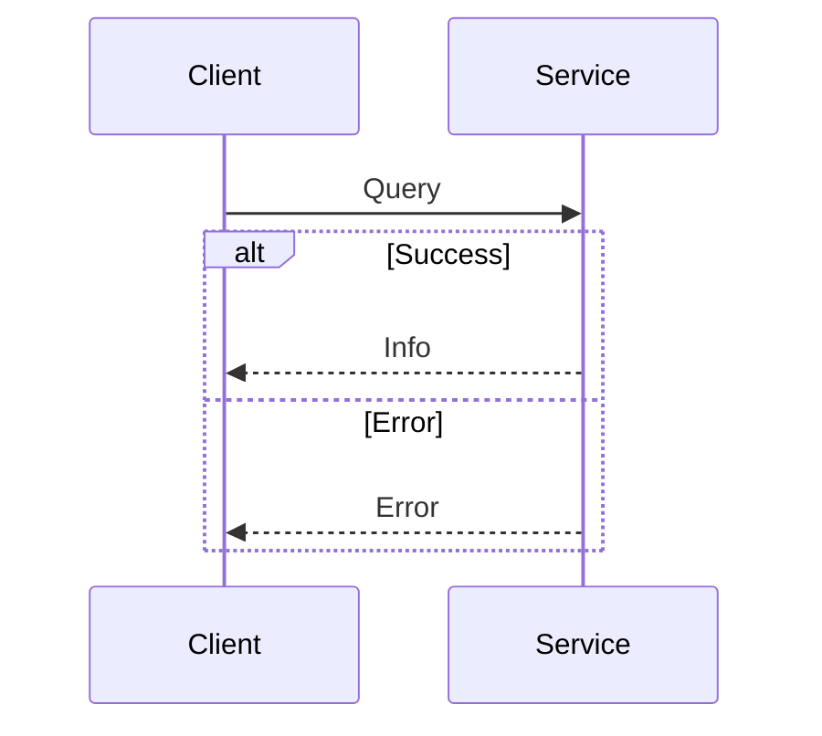

# Let's Work with Proto Errors Correctly :)

## Protobuf Error Handling

In programming, there are always several ways to solve the same problem. But not all of them are equally effective. Today, let's talk about ways to handle errors in gRPC — successful ones and not so much.

```proto
message Result {
  oneof response {
    error.v1.Error error = 1;
    info.v1.Info info = 2;
  }
}
```

At first glance, it might seem that using oneof to represent either an error or a result is convenient. However, this approach introduces unnecessary complexity into the message exchange protocol and degrades code readability. gRPC provides built-in tools for working with errors that allow you to elegantly and efficiently convey error information.

Why is using `oneof` for errors a bad idea? First, it makes it difficult to use gRPC's standard error mechanism and status codes, which are designed for this purpose. Second, it can lead to confusion on the client side when needing to distinguish successful responses from errors.


The diagram shows how handling two types of requests complicates the client logic

## Error Codes in gRPC

Error codes in gRPC architecture are especially important for effective interaction between client and server. They help the client understand the cause of the problem and respond appropriately.

Proper and effective error management in gRPC plays a key role in creating reliable and maintainable systems. Using standard error codes and gRPC mechanisms not only simplifies error handling on the client side but also ensures clarity and predictability of system behavior. Instead of using constructs like oneof for error handling, it's better to use gRPC's built-in capabilities for transmitting detailed error information.

Here's how you can use the gRPC code codes.NotFound to report that something is missing:

```go
import "google.golang.org/grpc/status"
import "google.golang.org/grpc/codes"

// ...

err := status.Error(codes.NotFound, "couldn't find the cat")

// ...
```

This approach simplifies error handling on the client side, which makes it easier to understand the response data structure. Additionally, errors returned via status.Error are converted to HTTP statuses when transported through gRPC-Gateway, making errors understandable even outside of gRPC.

But what if we need more flexibility in the error response? For example, adding additional meta-information or custom error codes?

The gRPC system itself has the ability to attach additional data to an error — and thus extend the problem context:

```go
import (
  "google.golang.org/grpc/status"
  "google.golang.org/grpc/codes"
  "google.golang.org/genproto/googleapis/rpc/errdetails"
)

// ...

st := status.New(codes.InvalidArgument, "invalid parameter")
// General error form
errInfo := &errdetails.ErrorInfo{
	Reason: "Insufficient funds in account",
	Domain: "finance",
	Metadata: map[string]string{
		"my_meta_info": "my_meta_details",
	},
}

st, err := st.WithDetails(errInfo)
if err != nil {
	return fmt.Sprintf("st.WithDetails: %w", err)
}

return st.Err()
```

But in cases when you want to get more detailed errors — for example, specifying the problematic field. In such cases, you can use the BadRequest type and provide more details about the error.

## Defining and Using Custom Errors

But! What if the standard details options don't fit? We can create our own error types! :)

First, let's define a custom error in a proto file. We need to create a CustomErrorDetail error message. It will contain information about errors related to user data:

```proto
syntax = "proto3";

package myerrors;

message CustomErrorDetail {
  string reason = 1;
  string field = 2;
  string help = 3;
}
```

Now that we have the custom error definition, we can use it to pass more specific and detailed error information. This is especially useful when you need to point to specific fields or parameters that caused the error. Creating and using such CustomErrorDetail in server code allows not only reporting problems but also providing the client with recommendations for fixing them, making the interaction more transparent and efficient.

```go
import (
  "google.golang.org/grpc/status"
  "google.golang.org/grpc/codes"
  "google.golang.org/protobuf/types/known/anypb"
  "myerrors"
)

// ...

customErrorDetail := &myerrors.CustomErrorDetail{
    Reason: "Value out of range",
    Field: "age",
    Help: "The age must be between 0 and 120",
}

st := status.New(codes.InvalidArgument, "invalid parameter")
st, err = st.WithDetails(customErrorDetail)
if err != nil {
    return fmt.Sprintf("Unexpected error attaching custom error detail: %w", err)
}

return st.Err()
```

## Working from the Client Side

Now let's look at how the client side will interact with the gRPC error handling system we described earlier.

### Handling Standard Errors

When a client receives a response from a gRPC server, it can check for errors using standard gRPC mechanisms, for example:

```go
import (
  "context"
  "google.golang.org/grpc"
  "google.golang.org/grpc/codes"
  "google.golang.org/grpc/status"
  "log"
)

func main() {
  conn, err := grpc.Dial("localhost:50051", grpc.WithInsecure())
  if err != nil {
    log.Fatalf("did not connect: %v", err)
  }
  defer conn.Close()

  client := NewYourServiceClient(conn)
  response, err := client.YourMethod(context.Background(), &YourRequest{})
  if err != nil {
    st, ok := status.FromError(err)
    if ok {
      switch st.Code() {
      case codes.InvalidArgument:
        log.Println("Invalid argument error:", st.Message())
      case codes.NotFound:
        log.Println("Not found error:", st.Message())
      // Handle other error codes as necessary
      default:
        log.Println("Unexpected error:", st.Message())
      }
    } else {
      log.Fatalf("failed to call YourMethod: %v", err)
    }
  } else {
    log.Println("Response:", response)
  }
}
```

### Extracting Additional Error Details

And now for the most interesting part: for the client side to extract details for analysis, we need to process these details.

Here's how it can be done:

```go
import (
  "google.golang.org/grpc/status"
  "google.golang.org/genproto/googleapis/rpc/errdetails"
  "myerrors"
  "log"
)

// ...

func handleError(err error) {
  st, ok := status.FromError(err)
  if !ok {
    log.Fatalf("An unexpected error occurred: %v", err)
  }

  for _, detail := range st.Details() {
    switch t := detail.(type) {
    case *errdetails.BadRequest:
      // Handle bad request details
      for _, violation := range t.GetFieldViolations() {
        log.Printf("The field %s was wrong: %s\\n", violation.GetField(), violation.GetDescription())
      }
    case *myerrors.CustomErrorDetail:
      // Handle custom error details
      log.Printf("Custom error detail: Reason: %s, Field: %s, Help: %s\\n", t.Reason, t.Field, t.Help)
    // Add handling for other error types as necessary
    default:
      log.Printf("Received an unknown error detail type: %v\\n", t)
    }
  }
}
```

### Conclusion

We've covered how to use standard gRPC error codes, how to add additional data to errors, and how to create and handle custom errors. These approaches allow for more flexible and detailed error handling, which is especially important for complex systems where a simple error message may be insufficient.

When designing an API, it's important to remember that the client side should be able to easily and unambiguously interpret server responses. Using standard gRPC mechanisms for errors helps achieve this goal, improving the interaction between client and server and making the system as a whole more robust and understandable.
