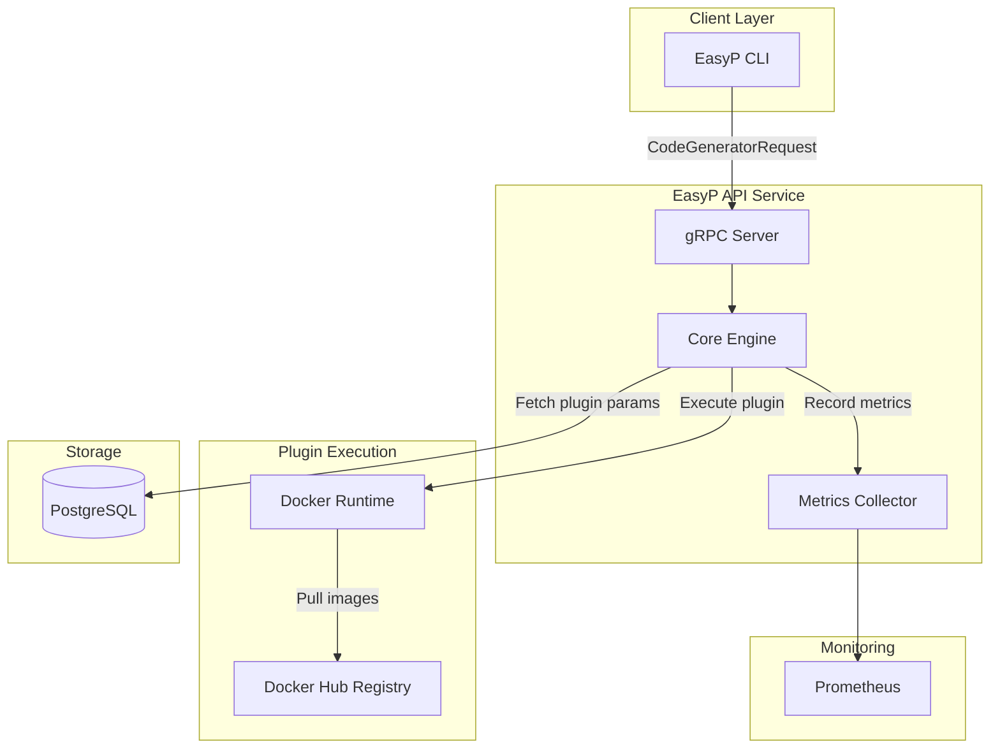
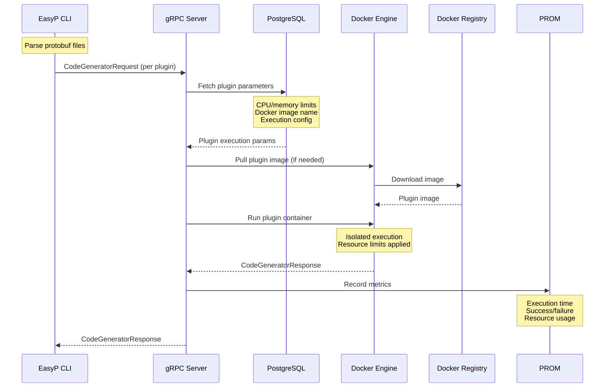

# API Service Overview

**Centralized protobuf plugin execution service for consistent, isolated code generation**

The EasyP API Service eliminates plugin management chaos by providing centralized execution of protobuf/gRPC plugins as isolated Docker containers. It offers a unified platform for teams to standardize their code generation workflows without the operational overhead of managing plugins across individual developer machines.

## Why EasyP API Service?

### The Challenge

Managing protobuf/gRPC code generation across development teams creates significant operational complexity:

#### Version Inconsistencies
- Developers use different plugin versions locally, causing build failures and inconsistent generated code
- "Works on my machine" syndrome when generated code differs between environments
- Manual coordination required to keep entire teams synchronized on plugin versions

#### Operational Overhead
- DevOps teams spend significant time managing plugin installations across developer machines
- Each new team member requires manual setup of correct plugin versions
- Plugin updates require coordinating with every developer individually
- No centralized control over which plugin versions are approved for use

#### Security & Compliance Risks
- Developers install plugins from various sources without security validation
- No audit trail of which plugins were used for which builds
- Difficult to enforce security policies on code generation tools

### The Solution: Centralized Plugin Execution

EasyP API Service eliminates these operational headaches by centralizing plugin management:

| Challenge | Solution |
|-----------|----------|
| **Version Control** | Deploy new plugin versions to entire team instantly via Docker images |
| **Operations** | Operations team controls plugin configurations without touching developer machines |
| **Security** | All plugins run in isolated Docker containers with resource constraints |
| **Consistency** | Consistent execution environment regardless of developer's local setup |
| **Developer Experience** | No local plugin installation or maintenance required |

## Architecture Overview

The EasyP API Service uses a streamlined architecture focused on reliable plugin execution:



## Key Components

### API Layer
- **gRPC Server**: Primary API for code generation requests
- Each plugin execution is a separate gRPC request
- Receives `CodeGeneratorRequest` from CLI

### Execution Engine
- **Docker Runtime**: Isolated container execution for plugins
- Pulls plugin images from public Docker registries (Docker Hub, etc.)
- Enforces resource limits (CPU, memory) per plugin

### Storage Layer
- **PostgreSQL**: Stores plugin execution parameters
  - Resource limits (CPU, memory allocation)
  - Plugin configuration and metadata
  - Execution logs for auditing
  - _Note: Storage capabilities will be expanded in future releases_

### Monitoring
- **Prometheus**: Metrics collection and monitoring
- Tracks execution times, success rates, and resource usage

## How It Works

### Local Execution (EasyP CLI)
When running locally, the EasyP CLI supports:
- **Installed plugins**: System-installed protoc plugins
- **WASM plugins**: Fast, lightweight WebAssembly plugins

### Remote Execution (API Service)
When using the API Service:
- **Docker only**: All plugins run as Docker containers
- **Centralized control**: Operations team manages available plugins
- **Consistent environment**: Same execution environment for all developers

## Plugin Execution Flow



### Execution Steps

1. **CLI Parsing**: CLI parses protobuf files locally
2. **Request Sending**: CLI sends `CodeGeneratorRequest` to API Service (one request per plugin)
3. **Parameter Lookup**: API Service fetches plugin execution parameters from PostgreSQL
4. **Docker Execution**: API Service runs plugin in isolated Docker container
5. **Metrics Recording**: Execution metrics are recorded (at end of request)
6. **Response**: Generated code is returned to CLI

## Key Features

| Feature | Description |
|---------|-------------|
| **🐳 Plugin Isolation** | Each plugin runs in a secure, isolated Docker container |
| **⚙️ Resource Control** | CPU and memory limits enforced per plugin |
| **📊 Metrics & Monitoring** | Prometheus metrics for all operations |
| **🔄 Version Management** | Centralized plugin version control via Docker images |
| **⚡ Simple Protocol** | Standard `CodeGeneratorRequest/Response` protocol |
| **🔒 Security First** | Container isolation with resource constraints |

## Configuration

The service is configured via environment variables:

### Server Configuration
```bash
EASYP_SERVICE_HOST=0.0.0.0
EASYP_SERVICE_GRPC_PORT=8080
```

### Database Configuration
```bash
EASYP_SERVICE_DB_HOST=localhost
EASYP_SERVICE_DB_PORT=5432
EASYP_SERVICE_DB_NAME=easyp_service
EASYP_SERVICE_DB_USER=easyp
EASYP_SERVICE_DB_PASSWORD=password
```

### Docker Configuration
```bash
# Docker socket for container execution
DOCKER_HOST=unix:///var/run/docker.sock
```

## Plugin Parameters Storage

PostgreSQL stores execution parameters for each plugin:

```sql
-- Example plugin configuration
{
  "plugin_name": "protobuf/go:v1.36.10",
  "docker_image": "easyp/protoc-gen-go:v1.36.10",
  "resources": {
    "cpu_limit": "1.0",
    "memory_limit": "512MB"
  },
  "execution_config": {
    "timeout": "30s",
    "network": "none"
  }
}
```

::: tip
The storage schema and capabilities will be expanded in future releases to support additional features like audit logging, usage analytics, and plugin caching.
:::

## Integration with EasyP CLI

Configure your `easyp.yaml` to use remote plugin execution:

```yaml
generate:
  plugins:
    # Remote plugin execution via API Service
    - remote: api.easyp.tech/protobuf/go:v1.36.10
      out: .
      opts:
        paths: source_relative
    
    - remote: api.easyp.tech/grpc/go:v1.5.1
      out: .
      opts:
        paths: source_relative
```

Then generate code:

```bash
easyp generate
```

The CLI will:
1. Parse your protobuf files
2. Send separate requests to API Service for each plugin
3. Receive generated code responses
4. Write generated files to specified output directories

## Available Metrics

Prometheus metrics exposed by the service:

| Metric | Description |
|--------|-------------|
| `easyp_api_service_api_grpc_server_handled_total` | Total gRPC requests by status code |
| `easyp_api_service_api_grpc_server_handling_seconds` | gRPC request latency histogram |
| `easyp_api_service_generated_plugin_code_total` | Plugin executions by plugin name |
| `easyp_api_service_repo_call_duration_seconds` | Database query latency |
| `easyp_api_service_repo_errors_total` | Database errors count |
| `easyp_api_service_standard_panics_total` | Recovered panics count |

## Performance Characteristics

| Metric | Typical Value | Notes |
|--------|---------------|-------|
| **Cold Start** | 2-5 seconds | First time pulling plugin image |
| **Warm Start** | 100-500ms | Plugin image cached by Docker |
| **Throughput** | 20-50 concurrent | Depends on available resources |
| **Memory Usage** | 50-200MB | Per plugin execution |

## Security

### Container Isolation
- Each plugin runs in a separate, ephemeral container
- No network access during plugin execution
- Resource limits (CPU, memory) enforced via Docker
- Containers destroyed after execution

### API Security
- gRPC-based communication
- Support for authentication tokens (production deployments)
- Input validation for all requests
- Execution audit logs stored in PostgreSQL

## Production Considerations

### Scalability
- **Horizontal scaling**: Deploy multiple service instances behind load balancer
- **Resource management**: Configure appropriate CPU/memory limits per plugin
- **Database**: PostgreSQL can be replicated for high availability

### Monitoring
- **Prometheus metrics**: Monitor all aspects of service health
- **Alerting**: Set up alerts for high error rates or slow execution
- **Logs**: Structured logging for debugging and audit trails

### Future Enhancements
The API Service is actively developed with planned features including:
- Plugin result caching for faster repeated executions
- Enhanced audit logging and usage analytics
- Support for custom plugin registries
- Advanced resource scheduling and optimization

## Community and Support

- **💬 [Telegram Chat](https://t.me/easyptech)** - Community discussion
- **🐛 [GitHub Issues](https://github.com/easyp-tech/service/issues)** - Bug reports and features
- **📖 [Documentation](https://easyp.tech)** - Complete documentation

---

*Simplify your protobuf workflows with centralized plugin execution*