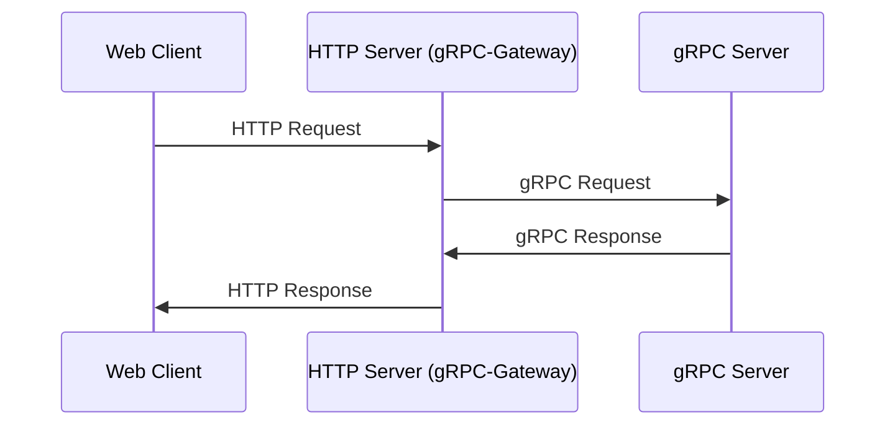
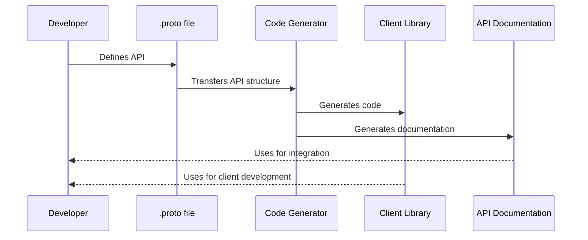
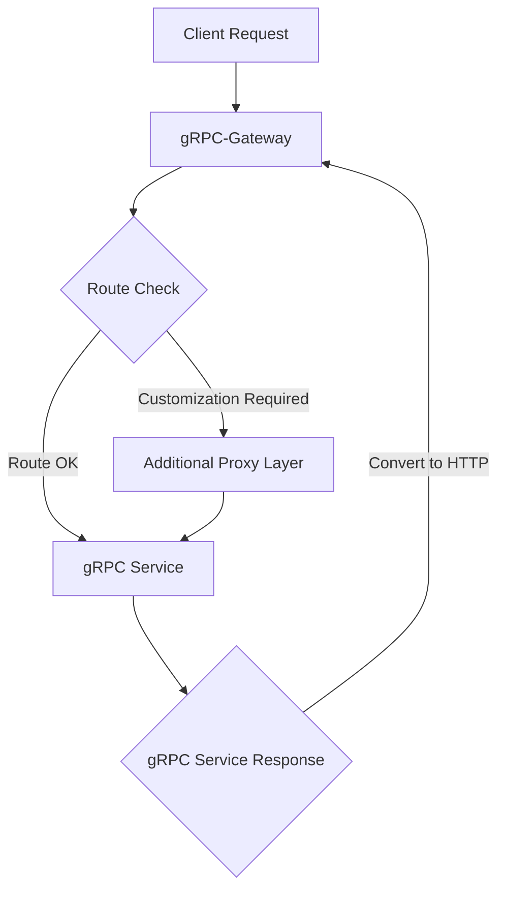

# Откажитесь уже наконец от gin, echo и <иной ваш фреймворк>

## Введение: Пересмотр Традиций в Мире Go
В мире разработки на Go выбор фреймворка часто превращается в лояльность, сопоставимую с выбором между Apple и Android. Фреймворки вроде Gin, Echo и Beego долгие годы были верными спутниками программистов, помогая быстро развертывать проекты и достигать первых успехов. Они предлагали удобные инструменты и привычные шаблоны работы, но со временем становится очевидным, что у каждого свой «язык». Это создаёт трудности при переходе между ними или интеграции с другими системами.

Ситуация усугубляется, если проекты разрастаются, а масштабируемость и поддержка становятся критически важными. Здесь каждый несовместимый компонент или разнообразие подходов превращается в препятствие, требующее дополнительных ресурсов и времени. Как если бы вы каждый раз, переходя с одного фреймворка на другой, переезжали в новый дом, где даже привычный световой выключатель находится не там, куда рука тянется автоматически.

### Для тех, кто хочет углубиться в историю и особенности каждого фреймворка, предлагаю ознакомиться с подробными обзорами и сравнениями:

- [Beego: An Overview and Comparison with Other Frameworks](https://medium.com/@eric.a.nugroho/beego-an-overview-and-comparison-with-other-framework-5211b08124ea)
- [Building Microservice Using Golang Echo Framework](https://medium.com/cuddle-ai/building-microservice-using-golang-echo-framework-ff10ba06d508)
- [Go with Gin](https://maneeshaindrachapa.medium.com/go-with-gin-83865cd5cd81)

В этой статье мы рассмотрим, почему пришло время отказаться от привычной многообразности в пользу стандартизации и как gRPC-Gateway может стать «универсальным переводчиком», способным объединить разрозненные диалекты Go-фреймворков в единый, понятный всем язык взаимодействия микросервисов.

## Стандартизация, стандартизация и еще раз стандартизация

Когда речь заходит о создании серверов на Go, каждый фреймворк предлагает свой набор правил и инструментов. Изначально это кажется большим плюсом: вы можете выбрать именно то, что подходит под ваши конкретные нужды и стиль работы. Однако, представьте себе сложность, когда в одном проекте необходимо совместить модули, написанные с использованием разных фреймворков. Это сравнимо с попыткой собрать пазл, где каждая часть произведена разными производителями и не сочетается с остальными.

Примеры Gin, Echo и, не дай Бог, Beego часто всплывают в беседах разработчиков. Они, без сомнения, оказали огромное влияние на сообщество Go и поддерживали многие проекты на разных этапах их жизненного цикла. Особенно Gin, который уже более 10 лет является надёжным инструментом для многих. Но современные реалии разработки требуют гибкости и возможности масштабирования, а привязка к одному фреймворку может серьёзно ограничить обе эти характеристики.

Так, к примеру, если ваш проект начался с использования Echo, и вы хотите интегрировать стороннюю библиотеку, написанную для Gin, вы столкнетесь с необходимостью переписывания кода или создания «мостов» между различиями в API. Это не только увеличивает рабочий объём, но и вносит дополнительную сложность в поддержку и обновление кода.

Стандартизация — это ключ к решению этих проблем. Переход к использованию gRPC и HTTP/2, а также адаптация таких инструментов, как gRPC-Gateway, открывает новые горизонты в вопросах совместимости и универсальной коммуникации. Подумайте о gRPC-Gateway как об универсальном переводчике, который позволяет вам говорить на одном языке с разными системами, не вдаваясь в особенности каждой из них.

## Знакомство с gRPC-Gateway

gRPC-Gateway — это магический мост, соединяющий старый мир RESTful JSON API и современный мир gRPC. Он позволяет вашим сервисам говорить на двух языках, обслуживая и традиционные HTTP запросы, и мощные gRPC вызовы. Это особенно удобно, когда у вас есть разнообразные клиенты: некоторые из них предпочитают общаться через простые HTTP запросы, в то время как другие — через gRPC.

Давайте рассмотрим жизненный пример: вы управляете веб-сервисом, который предоставляет информацию о погоде. Ваши данные — это не просто текст, это объёмные наборы данных с метеостанций. Здесь gRPC идеально подходит для пересылки этих данных с высокой скоростью и надежностью. Но ваши клиенты — это не только другие сервера, но и мобильные приложения и веб-браузеры, которые ожидают удобные и понятные JSON ответы.

Вот как gRPC-Gateway вступает в игру: он трансформирует HTTP запросы в gRPC вызовы и обратно, делая ваш сервис доступным для всех, без необходимости поддержки двух разных API. Всё это происходит за кулисами, и для конечного пользователя это выглядит как обычная работа с веб-сайтом или приложением.

Пример кода, который вы могли бы видеть без gRPC-Gateway, выглядит примерно так:

```proto
syntax = "proto3";

package your.service.v1;

option go_package = "github.com/yourorg/yourprotos/gen/go/your/service/v1";

message StringMessage {
  string value = 1;
}

service YourService {
  rpc Echo(StringMessage) returns (StringMessage) {}
}
```

А теперь добавим немного "магии" gRPC-Gateway:

```proto
syntax = "proto3";
package your.service.v1;
option go_package = "github.com/yourorg/yourprotos/gen/go/your/service/v1";
import "google/api/annotations.proto";

message StringMessage {
  string value = 1;
}

service YourService {
  rpc Echo(StringMessage) returns (StringMessage) {
      option (google.api.http) = {
      post: "/v1/example/echo"
      body: "*"
    };
  }
}
```

Эти несколько строк позволяют вам автоматически принимать HTTP POST запросы на адрес `/v1/example/echo` и обрабатывать их как вызовы gRPC. Это пример того, как gRPC-Gateway упрощает жизнь разработчикам, предоставляя единый, универсально понятный API.

## Сочетание GRPC и HTTP серверов

Возможность одновременного использования gRPC и HTTP в одном приложении – это как иметь в своем распоряжении и спортивный автомобиль, и внедорожник; вы можете наслаждаться скоростью и мощью, когда это необходимо, и надежностью и универсальностью в другой раз. gRPC-Gateway позволяет вашему сервису легко переключаться между этими двумя "транспортами", предоставляя такую гибкость.

Давайте рассмотрим обычный рабочий процесс:

- *HTTP запрос*: Клиент отправляет HTTP запрос, который достигает gRPC-Gateway.
- *Преобразование в gRPC*: Gateway анализирует запрос, преобразует его в соответствующий gRPC вызов и перенаправляет его на gRPC сервер.
- *Обработка gRPC сервером*: gRPC сервер обрабатывает запрос и отправляет ответ обратно в Gateway.
- *Преобразование в HTTP*: Gateway переводит gRPC ответ обратно в формат, понятный HTTP клиенту, и отправляет его обратно.

Этот процесс можно представить в виде диаграммы:



В реальной жизни это выглядит следующим образом: когда пользователь запрашивает информацию через веб-интерфейс, его запрос идет через gRPC-Gateway, который транслирует его в gRPC вызов. Затем, получив ответ от gRPC сервиса, Gateway «переводит» его обратно в HTTP ответ и отправляет пользователю, обеспечивая плавный и незаметный процесс взаимодействия.

А на уровне кода, это может выглядеть так:
```go
package main

import (
	"context"
	"log"
	"net"
	"net/http"

	"github.com/grpc-ecosystem/grpc-gateway/v2/runtime"
	"golang.org/x/sync/errgroup"
	"google.golang.org/grpc"
	"google.golang.org/grpc/credentials/insecure"

	echo "path/to/your/protobuf_package" 
)

const (
	grpcServerEndpoint = "localhost:50051"
	httpServerEndpoint = "localhost:8080"
)

type EchoService struct {
	echo.UnimplementedEchoServiceServer
}

func (s *EchoService) Echo(ctx context.Context, in *echo.EchoRequest) (*echo.EchoResponse, error) {
	return &echo.EchoResponse{Message: "Echo: " + in.Message}, nil
}

func main() {
	g, ctx := errgroup.WithContext(context.Background())

	g.Go(func() error {
		return startGRPCServer(ctx)
	})

	g.Go(func() error {
		return startHTTPServer(ctx)
	})

	if err := g.Wait(); err != nil {
		log.Fatalf("Не удалось запустить серверы: %s", err)
	}
}

func startGRPCServer(ctx context.Context) (err error) {
	lis, err := net.Listen("tcp", grpcServerEndpoint)
	if err != nil {
		return err
	}

	s := grpc.NewServer()
	echo.RegisterEchoServiceServer(s, &EchoService{})

	go func() {
		<-ctx.Done()
		s.GracefulStop()
	}()

	log.Printf("Запуск gRPC сервера на %s", grpcServerEndpoint)
	return s.Serve(lis)
}

func startHTTPServer(ctx context.Context) (err error) {
	mux := runtime.NewServeMux()
	opts := []grpc.DialOption{grpc.WithTransportCredentials(insecure.NewCredentials())}
	err = echo.RegisterEchoServiceHandlerFromEndpoint(ctx, mux, grpcServerEndpoint, opts)
	if err != nil {
		return err
	}

	srv := &http.Server{
		Addr:    httpServerEndpoint,
		Handler: mux,
	}

	go func() {
		<-ctx.Done()
		srv.Shutdown(ctx)
	}()

	log.Printf("Запуск HTTP сервера на %s", httpServerEndpoint)
	return srv.ListenAndServe()
}
```

Этот простой пример показывает, как в рамках одного приложения можно обеспечить работу и gRPC, и HTTP серверов, давая пользователям свободу выбора и обеспечивая разработчикам удобные инструменты для управления API.

## Преимущества использования gRPC-Gateway

gRPC-Gateway не просто облегчает разработку — он раскрывает новые возможности для систем, где требуется совместимость и гибкость. Это особенно важно в современных микросервисных архитектурах, где системы должны взаимодействовать друг с другом беспрепятственно и эффективно.

## Единая точка истины: одна схема для GRPC и RESTful API

Используя один .proto файл для описания как gRPC, так и RESTful API, мы получаем единство и согласованность интерфейсов. Это избавляет от необходимости поддерживать разные версии API для разных протоколов, что упрощает обновления и снижает шансы на ошибки. Если вы вносите изменения в .proto файл, они автоматически отражаются и в RESTful API, и в gRPC.

## Сокращение дублирования кода и упрощение поддержки

Поскольку gRPC-Gateway транслирует запросы REST в вызовы gRPC, разработчикам не нужно писать отдельные реализации для каждого протокола. Это освобождает усилия и время на создание дополнительных фич, а не на дублирование существующей функциональности.

## Автоматическая генерация клиентского кода и документации OpenAPI (Swagger)

gRPC-Gateway позволяет автоматически генерировать клиентские библиотеки для различных языков программирования и документацию API в формате OpenAPI (Swagger). Это не только ускоряет процесс разработки клиентских частей системы, но и обеспечивает актуальность документации, делая взаимодействие с API прозрачным и понятным для всех сторон.



Пример преимущества может выглядеть так: представьте, что ваша команда внедряет новую функцию в систему. Ранее это требовало бы обновления нескольких документов API и реализаций на разных языках. Теперь же, изменения вносятся в один .proto файл, и все необходимые обновления генерируются автоматически.

Эти преимущества делают gRPC-Gateway мощным инструментом, который может значительно упростить процесс разработки и поддержки микросервисных архитектур, делая их более модульными, гибкими и лёгкими в масштабировании.

## Недостатки и ограничения gRPC-Gateway

Несмотря на значительные преимущества, gRPC-Gateway не лишен недостатков, особенно когда речь заходит о сложных случаях использования и интеграции с существующими системами. Рассмотрим некоторые из этих ограничений:

## Ограниченная настройка и кастомизация

gRPC-Gateway прекрасно работает «из коробки» для многих стандартных сценариев, но его возможности кастомизации могут быть недостаточными для уникальных требований. Например, сложные требования к маршрутизации, тонкая настройка безопасности или специфичная обработка запросов могут потребовать дополнительных усилий и иногда написания дополнительного слоя проксирования.



## Более высокий порог входа для новичков

Для эффективного использования gRPC-Gateway, разработчикам необходимо изучить не только основы REST и HTTP, но и особенности работы с gRPC и protobuf. Это может создать дополнительные трудности для новичков или команд, привыкших к более традиционным REST API.

## Взаимодействие с другими инструментами и библиотеками

Интеграция с некоторыми инструментами мониторинга, логирования или трассировки может быть затруднена, так как gRPC-Gateway представляет собой ещё один уровень абстракции. Поэтому может потребоваться дополнительная настройка или поиск специализированных решений, которые совместимы с gRPC.

## Недостаточный контроль над HTTP-специфичными функциями

Некоторые HTTP-специфичные возможности, такие как управление кэшированием, куками, редиректами, могут быть не так легко реализуемы через gRPC-Gateway. Это может потребовать дополнительных обходных решений или разработки дополнительного кода для контроля над этими аспектами на уровне HTTP.

## Проблемы с передачей файлов

Передача файлов может быть проблематичной при использовании gRPC-Gateway. Из-за особенностей gRPC, большие файлы придется разбивать на множество маленьких частей для передачи, что может быть неэффективным и сложным в реализации. В некоторых случаях, может потребоваться более традиционный подход к обработке и передаче файлов.

## Влияние на производительность

Хотя gRPC-Gateway относительно эффективен, введение дополнительного прокси-слоя может немного увеличить задержку обработки запросов. В системах, где каждая миллисекунда имеет значение, это может стать критичным фактором.

## Заключение

Итак, мы разобрались, что gRPC-Gateway — это не просто ещё одна техническая штучка. Это как мостик между двумя мирами: уютным островом REST и стремительным континентом gRPC. И этот мостик может привести нас к чему-то удивительному — к API, которые проще в поддержке, быстрее в работе и дружелюбнее к разработчикам.

## Немного Размышлений

Мир технологий не стоит на месте, и мы тоже. Сегодня выбор в пользу gRPC-Gateway может показаться нововведением, но завтра он уже станет частью «старой доброй классики». Так что, если вы чувствуете, что пора расширять горизонты и исследовать новые технологии, возможно, gRPC-Gateway — это именно то, что нужно.

## Вот и Всё... Пока!

Не бойтесь экспериментировать и пробовать новые решения. Возможно, gRPC-Gateway не станет панацеей для всех ваших болей, но он определённо может стать одним из тех инструментов, который вы будете вспоминать с благодарностью. А что будет завтра? Кто знает, может, мы уже встретимся на новом повороте технологической эволюции!
