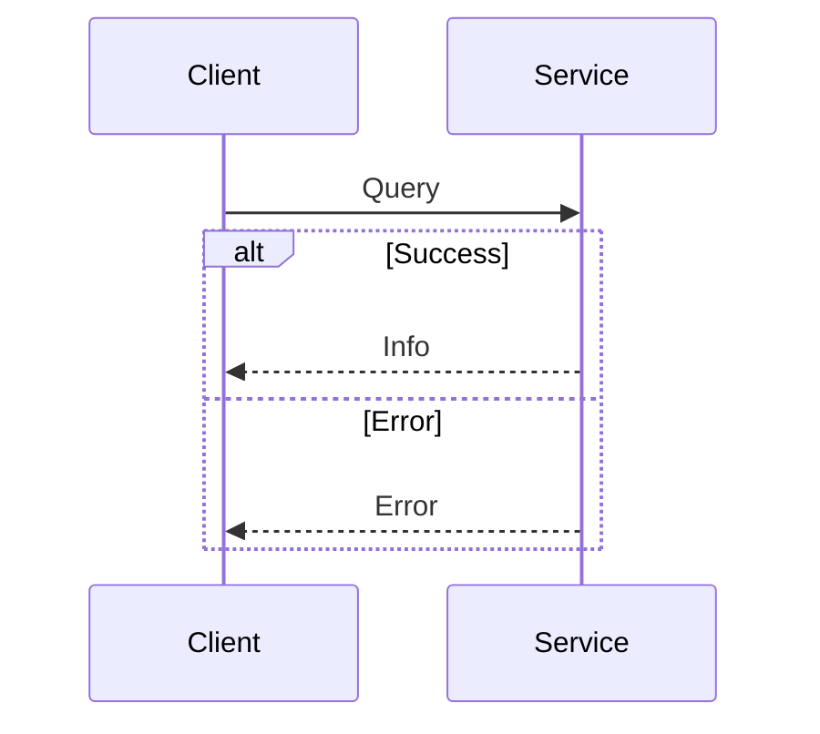

# Давайте работать с proto ошибками правильно :)

## Protobuf Error Handling

В программировании всегда есть несколько способов решения одной и той же проблемы. Но не все они одинаково эффективны. Сегодня поговорим о способах обработки ошибок в gRPC — удачных и не очень.

```proto
message Result {
  oneof response {
    error.v1.Error error = 1;
    info.v1.Info info = 2;
  }
}
```

На первый взгляд может показаться, что использование oneof для представления либо ошибки, либо результата — это удобно. Однако такой подход вносит ненужную сложность в протокол обмена сообщениями и ухудшает читаемость кода. gRPC предоставляет встроенные средства для работы с ошибками, которые позволяют элегантно и эффективно передавать информацию об ошибках.

Почему же использование `oneof` для ошибок — плохая идея? Во-первых, это затрудняет использование стандартного механизма ошибок gRPC и кодов состояний, которые предназначены для этой цели. Во-вторых, это может привести к путанице на стороне клиента при необходимости различать успешные ответы от ошибок.


На схеме видно, как обработка двух типов запроса утяжеляет логику клиента

## Коды ошибок в gRPC

Коды ошибок в архитектуре gRPC особенно важны для эффективного взаимодействия между клиентом и сервером. Они помогают клиенту понять причину проблемы и правильно отреагировать на нее.

Правильное и эффективное управление ошибками в gRPC играет ключевую роль в создании надежных и поддерживаемых систем. Использование стандартных кодов ошибок и механизмов gRPC позволяет не только упростить обработку ошибок на стороне клиента, но и обеспечить ясность и предсказуемость поведения системы. Вместо того чтобы использовать конструкции вроде oneof для обработки ошибок, лучше воспользоваться встроенными возможностями gRPC для передачи детализированной информации об ошибках.

Вот, как можно использовать gRPC-код codes.NotFound, чтобы сообщить об отсутствии чего-либо


```go
import "google.golang.org/grpc/status"
import "google.golang.org/grpc/codes"

// ...

err := status.Error(codes.NotFound, "не нашел котика")

// ...
```

Такой подход упрощает обработку ошибок на стороне клиента, а это облегчает понимание структуры данных ответа. Кроме того, ошибки, возвращаемые через status.Error преобразуются в HTTP-статусы при транспортировке через gRPC-Gateway, в таком случае ошибки становятся понятными и вне gRPC

Но, что делать, если нам нужно больше гибкости в ответе ошибки? К примеру добавить дополнительную мета-инфу или же кастомные коды ошибок?

В самой системе gRPC есть возможность прикрепить доп. данные к ошибке — и таким способом расширить контекст проблемы

```go
import (
  "google.golang.org/grpc/status"
  "google.golang.org/grpc/codes"
  "google.golang.org/genproto/googleapis/rpc/errdetails"
)

// ...

st := status.New(codes.InvalidArgument, "invalid parameter")
// Общая форма ошибки
errInfo := &errdetails.ErrorInfo{
	Reason: "Не хватает средств на счету",
	Domain: "finance",
	Metadata: map[string]string{
		"my_meta_info": "my_meta_details",
	},
}

st, err := st.WithDetails(errInfo)
if err != nil {
	return fmt.Sprintf("st.WithDetails: %w", err)
}

return st.Err()
```

Но, в случаях, когда хочется получать более детализированные ошибки — например, с уточнением проблемного поля. В таком случае можно воспользоваться типом BadRequest и прописать больше деталей об ошибке.

## Определение и использование кастомной ошибки

Но! Что делать, если стандартные варианты details не подходят? Мы можем сделать свои собственные типы ошибок! :)

Сначала определим кастомную ошибку в proto файле. Нам нужно создать message ошибки CustomErrorDetail. В ней будет содержаться информация об ошибках, связанных с пользовательскими данными:

```proto
syntax = "proto3";

package myerrors;

message CustomErrorDetail {
  string reason = 1;
  string field = 2;
  string help = 3;
}
```

Теперь, когда у нас есть определение кастомной ошибки, мы можем использовать её, чтобы передавать более специфичную и детализированную информацию об ошибках. Это особенно полезно, когда требуется указать на конкретные поля или параметры, вызвавшие ошибку. Создание и использование такогоCustomErrorDetailв коде сервера позволяет не только сообщать о проблемах, но и предоставлять клиенту рекомендации по их исправлению, что делает взаимодействие более прозрачным и эффективным.

```go
import (
  "google.golang.org/grpc/status"
  "google.golang.org/grpc/codes"
  "google.golang.org/protobuf/types/known/anypb"
  "myerrors"
)

// ...

customErrorDetail := &myerrors.CustomErrorDetail{
    Reason: "Value out of range",
    Field: "age",
    Help: "The age must be between 0 and 120",
}

st := status.New(codes.InvalidArgument, "invalid parameter")
st, err = st.WithDetails(customErrorDetail)
if err != nil {
    return fmt.Sprintf("Unexpected error attaching custom error detail: %w", err)
}

return st.Err()
```

## Работа с клиентской стороны
Теперь давайте рассмотрим, как клиентская сторона будет взаимодействовать с системой обработки ошибок в gRPC, которую мы описали ранее.

### Обработка стандартных ошибок
Когда клиент получает ответ от gRPC сервера, он может проверять наличие ошибок с помощью стандартных механизмов gRPC, например:

```go
import (
  "context"
  "google.golang.org/grpc"
  "google.golang.org/grpc/codes"
  "google.golang.org/grpc/status"
  "log"
)н

func main() {
  conn, err := grpc.Dial("localhost:50051", grpc.WithInsecure())
  if err != nil {
    log.Fatalf("did not connect: %v", err)
  }
  defer conn.Close()

  client := NewYourServiceClient(conn)
  response, err := client.YourMethod(context.Background(), &YourRequest{})
  if err != nil {
    st, ok := status.FromError(err)
    if ok {
      switch st.Code() {
      case codes.InvalidArgument:
        log.Println("Invalid argument error:", st.Message())
      case codes.NotFound:
        log.Println("Not found error:", st.Message())
      // Обработайте другие коды ошибок по необходимости
      default:
        log.Println("Unexpected error:", st.Message())
      }
    } else {
      log.Fatalf("failed to call YourMethod: %v", err)
    }
  } else {
    log.Println("Response:", response)
  }
}
```

### Извлечение дополнительных деталей ошибок

А теперь самое интересное: чтобы клиентская сторона могла извлечь details для анализа, нам нужно эти самые details обработать.

Вот, как это можно сделать:
```go
import (
  "google.golang.org/grpc/status"
  "google.golang.org/genproto/googleapis/rpc/errdetails"
  "myerrors"
  "log"
)

// ...

func handleError(err error) {
  st, ok := status.FromError(err)
  if !ok {
    log.Fatalf("An unexpected error occurred: %v", err)
  }

  for _, detail := range st.Details() {
    switch t := detail.(type) {
    case *errdetails.BadRequest:
      // Обработка деталей неверного запроса
      for _, violation := range t.GetFieldViolations() {
        log.Printf("The field %s was wrong: %s\\\\n", violation.GetField(), violation.GetDescription())
      }
    case *myerrors.CustomErrorDetail:
      // Обработка кастомных деталей ошибок
      log.Printf("Custom error detail: Reason: %s, Field: %s, Help: %s\\\\n", t.Reason, t.Field, t.Help)
    // Добавьте обработку других типов ошибок по необходимости
    default:
      log.Printf("Received an unknown error detail type: %v\\\\n", t)
    }
  }
}
```

### Заключение
Мы рассмотрели, как использовать стандартные коды ошибок gRPC, как добавлять дополнительные данные к ошибкам и как создавать и обрабатывать кастомные ошибки. Эти подходы позволяют более гибко и детализированно подходить к обработке ошибок, что особенно важно для сложных систем, где простое сообщение об ошибке может быть недостаточным.

При проектировании API важно помнить, что клиентская сторона должна иметь возможность легко и однозначно интерпретировать ответы сервера. Использование стандартных механизмов gRPC для ошибок помогает достичь этой цели, улучшая взаимодействие между клиентом и сервером и делая систему в целом более устойчивой и понятной.
