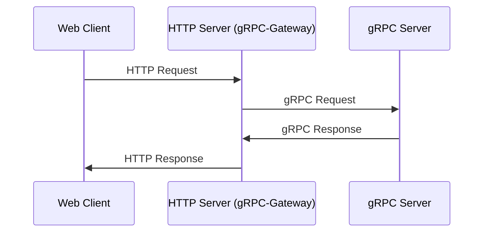
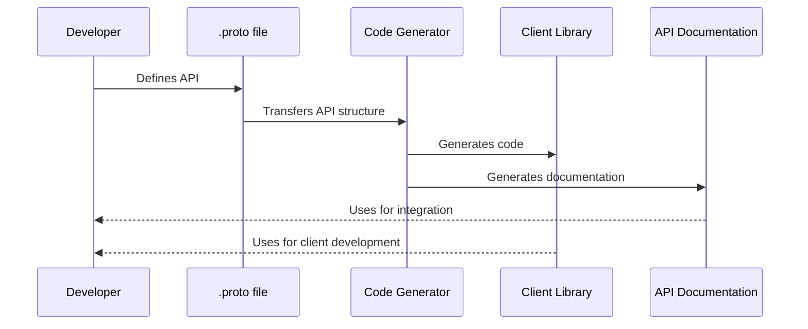
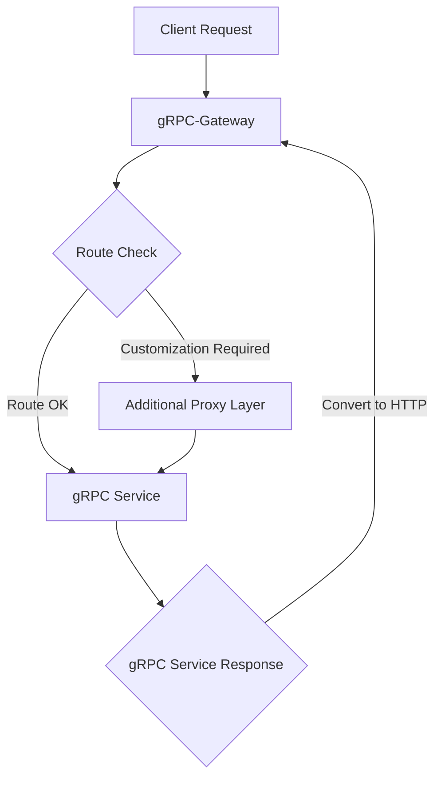

# Finally Give Up Gin, Echo, and <Your Framework Here>

## Introduction: Rethinking Traditions in the Go World

In the world of Go development, choosing a framework often becomes a loyalty issue comparable to choosing between Apple and Android. Frameworks like Gin, Echo, and Beego have been faithful companions to developers for years, helping to quickly deploy projects and achieve early successes. They offered convenient tools and familiar work patterns, but over time it becomes evident that each has its own "language." This creates difficulties when transitioning between them or integrating with other systems.

The situation worsens as projects grow and scalability and maintenance become critically important. Here, every incompatible component or diversity of approaches becomes an obstacle requiring additional resources and time. It's as if every time you switch from one framework to another, you move to a new house where even the familiar light switch isn't where your hand automatically reaches.

### For those who want to delve deeper into the history and features of each framework, I suggest reviewing these detailed overviews and comparisons:

- [Beego: An Overview and Comparison with Other Frameworks](https://medium.com/@eric.a.nugroho/beego-an-overview-and-comparison-with-other-framework-5211b08124ea)
- [Building Microservice Using Golang Echo Framework](https://medium.com/cuddle-ai/building-microservice-using-golang-echo-framework-ff10ba06d508)
- [Go with Gin](https://maneeshaindrachapa.medium.com/go-with-gin-83865cd5cd81)

In this article, we'll explore why it's time to abandon the familiar diversity in favor of standardization and how gRPC-Gateway can become the "universal translator" capable of uniting the disparate dialects of Go frameworks into a single, universally understood language for microservice interaction.

## Standardization, Standardization, and More Standardization

When it comes to creating servers in Go, each framework offers its own set of rules and tools. Initially, this seems like a big plus: you can choose exactly what suits your specific needs and work style. However, imagine the complexity when you need to combine modules written using different frameworks in one project. It's comparable to trying to assemble a puzzle where each piece is produced by different manufacturers and doesn't fit with the others.

Examples of Gin, Echo, and, heaven forbid, Beego often come up in developer conversations. They have undoubtedly had a huge impact on the Go community and have supported many projects at different stages of their lifecycle. Especially Gin, which has been a reliable tool for many for over 10 years. But modern development realities require flexibility and scalability, and being tied to one framework can seriously limit both of these characteristics.

For example, if your project started using Echo and you want to integrate a third-party library written for Gin, you'll face the need to rewrite code or create "bridges" between API differences. This not only increases the workload but also adds additional complexity to code maintenance and updates.

Standardization is the key to solving these problems. Transitioning to use gRPC and HTTP/2, as well as adopting tools like gRPC-Gateway, opens new horizons in terms of compatibility and universal communication. Think of gRPC-Gateway as a universal translator that allows you to speak the same language with different systems without getting into the specifics of each one.

## Getting to Know gRPC-Gateway

gRPC-Gateway is a magical bridge connecting the old world of RESTful JSON APIs and the modern world of gRPC. It allows your services to speak two languages, serving both traditional HTTP requests and powerful gRPC calls. This is especially convenient when you have diverse clients: some prefer to communicate via simple HTTP requests, while others use gRPC.

Let's consider a real-life example: you manage a web service that provides weather information. Your data isn't just text; it's voluminous datasets from weather stations. Here, gRPC is perfect for transmitting this data with high speed and reliability. But your clients aren't just other servers; they're also mobile applications and web browsers that expect convenient and understandable JSON responses.

This is where gRPC-Gateway comes into play: it transforms HTTP requests into gRPC calls and back, making your service accessible to everyone without the need to support two different APIs. All of this happens behind the scenes, and for the end user, it looks like normal interaction with a website or application.

Sample code you might see without gRPC-Gateway looks something like this:

```proto
syntax = "proto3";

package your.service.v1;

option go_package = "github.com/yourorg/yourprotos/gen/go/your/service/v1";

message StringMessage {
  string value = 1;
}

service YourService {
  rpc Echo(StringMessage) returns (StringMessage) {}
}
```

Now let's add a bit of gRPC-Gateway "magic":

```proto
syntax = "proto3";
package your.service.v1;
option go_package = "github.com/yourorg/yourprotos/gen/go/your/service/v1";
import "google/api/annotations.proto";

message StringMessage {
  string value = 1;
}

service YourService {
  rpc Echo(StringMessage) returns (StringMessage) {
      option (google.api.http) = {
      post: "/v1/example/echo"
      body: "*"
    };
  }
}
```

These few lines allow you to automatically accept HTTP POST requests at `/v1/example/echo` and process them as gRPC calls. This is an example of how gRPC-Gateway simplifies developers' lives by providing a single, universally understood API.

## Combining gRPC and HTTP Servers

The ability to simultaneously use gRPC and HTTP in one application is like having both a sports car and an SUV at your disposal; you can enjoy speed and power when needed, and reliability and versatility at other times. gRPC-Gateway allows your service to easily switch between these two "transports," providing such flexibility.

Let's look at a typical workflow:

- *HTTP request*: The client sends an HTTP request that reaches gRPC-Gateway.
- *Conversion to gRPC*: The Gateway parses the request, converts it to the corresponding gRPC call, and forwards it to the gRPC server.
- *gRPC server processing*: The gRPC server processes the request and sends a response back to the Gateway.
- *Conversion to HTTP*: The Gateway translates the gRPC response back to a format understandable by the HTTP client and sends it back.

This process can be represented as a diagram:



In real life, this looks like the following: when a user requests information through a web interface, their request goes through gRPC-Gateway, which translates it into a gRPC call. Then, after receiving a response from the gRPC service, the Gateway "translates" it back into an HTTP response and sends it to the user, ensuring a smooth and seamless interaction process.

At the code level, this might look like:
```go
package main

import (
	"context"
	"log"
	"net"
	"net/http"

	"github.com/grpc-ecosystem/grpc-gateway/v2/runtime"
	"golang.org/x/sync/errgroup"
	"google.golang.org/grpc"
	"google.golang.org/grpc/credentials/insecure"

	echo "path/to/your/protobuf_package" 
)

const (
	grpcServerEndpoint = "localhost:50051"
	httpServerEndpoint = "localhost:8080"
)

type EchoService struct {
	echo.UnimplementedEchoServiceServer
}

func (s *EchoService) Echo(ctx context.Context, in *echo.EchoRequest) (*echo.EchoResponse, error) {
	return &echo.EchoResponse{Message: "Echo: " + in.Message}, nil
}

func main() {
	g, ctx := errgroup.WithContext(context.Background())

	g.Go(func() error {
		return startGRPCServer(ctx)
	})

	g.Go(func() error {
		return startHTTPServer(ctx)
	})

	if err := g.Wait(); err != nil {
		log.Fatalf("Failed to start servers: %s", err)
	}
}

func startGRPCServer(ctx context.Context) (err error) {
	lis, err := net.Listen("tcp", grpcServerEndpoint)
	if err != nil {
		return err
	}

	s := grpc.NewServer()
	echo.RegisterEchoServiceServer(s, &EchoService{})

	go func() {
		<-ctx.Done()
		s.GracefulStop()
	}()

	log.Printf("Starting gRPC server on %s", grpcServerEndpoint)
	return s.Serve(lis)
}

func startHTTPServer(ctx context.Context) (err error) {
	mux := runtime.NewServeMux()
	opts := []grpc.DialOption{grpc.WithTransportCredentials(insecure.NewCredentials())}
	err = echo.RegisterEchoServiceHandlerFromEndpoint(ctx, mux, grpcServerEndpoint, opts)
	if err != nil {
		return err
	}

	srv := &http.Server{
		Addr:    httpServerEndpoint,
		Handler: mux,
	}

	go func() {
		<-ctx.Done()
		srv.Shutdown(ctx)
	}()

	log.Printf("Starting HTTP server on %s", httpServerEndpoint)
	return srv.ListenAndServe()
}
```

This simple example shows how you can ensure the operation of both gRPC and HTTP servers within a single application, giving users freedom of choice and providing developers with convenient tools for API management.

## Benefits of Using gRPC-Gateway

gRPC-Gateway doesn't just simplify development—it unlocks new possibilities for systems where compatibility and flexibility are required. This is especially important in modern microservice architectures where systems must interact with each other seamlessly and efficiently.

## Single Source of Truth: One Schema for gRPC and RESTful API

Using a single .proto file to describe both gRPC and RESTful APIs, we achieve unity and consistency of interfaces. This eliminates the need to maintain different API versions for different protocols, simplifying updates and reducing the chance of errors. If you make changes to the .proto file, they are automatically reflected in both the RESTful API and gRPC.

## Reducing Code Duplication and Simplifying Maintenance

Since gRPC-Gateway translates REST requests into gRPC calls, developers don't need to write separate implementations for each protocol. This frees up effort and time for creating additional features rather than duplicating existing functionality.

## Automatic Generation of Client Code and OpenAPI (Swagger) Documentation

gRPC-Gateway allows automatic generation of client libraries for various programming languages and API documentation in OpenAPI (Swagger) format. This not only speeds up the development process of client parts of the system but also ensures documentation is up-to-date, making API interaction transparent and understandable for all parties.



An example benefit might look like this: imagine your team is implementing a new feature in the system. Previously, this would have required updating several API documents and implementations in different languages. Now, changes are made to a single .proto file, and all necessary updates are generated automatically.

These benefits make gRPC-Gateway a powerful tool that can significantly simplify the development and maintenance process of microservice architectures, making them more modular, flexible, and easy to scale.

## Disadvantages and Limitations of gRPC-Gateway

Despite significant advantages, gRPC-Gateway is not without drawbacks, especially when it comes to complex use cases and integration with existing systems. Let's consider some of these limitations:

## Limited Configuration and Customization

gRPC-Gateway works great "out of the box" for many standard scenarios, but its customization capabilities may be insufficient for unique requirements. For example, complex routing requirements, fine-tuning security, or specific request handling may require additional effort and sometimes writing an additional proxy layer.



## Higher Entry Barrier for Beginners

To effectively use gRPC-Gateway, developers need to learn not only the basics of REST and HTTP but also the specifics of working with gRPC and protobuf. This can create additional difficulties for beginners or teams accustomed to more traditional REST APIs.

## Interaction with Other Tools and Libraries

Integration with some monitoring, logging, or tracing tools can be difficult since gRPC-Gateway represents another layer of abstraction. Therefore, additional configuration or searching for specialized solutions compatible with gRPC may be required.

## Insufficient Control Over HTTP-Specific Features

Some HTTP-specific features, such as cache management, cookies, and redirects, may not be as easily implementable through gRPC-Gateway. This may require additional workarounds or development of additional code to control these aspects at the HTTP level.

## File Transfer Issues

File transfer can be problematic when using gRPC-Gateway. Due to gRPC specifics, large files must be split into many small parts for transmission, which can be inefficient and complex to implement. In some cases, a more traditional approach to file handling and transfer may be required.

## Performance Impact

Although gRPC-Gateway is relatively efficient, introducing an additional proxy layer can slightly increase request processing latency. In systems where every millisecond matters, this can become a critical factor.

## Conclusion

So, we've figured out that gRPC-Gateway isn't just another technical gadget. It's like a bridge between two worlds: the cozy island of REST and the swift continent of gRPC. And this bridge can lead us to something amazing—APIs that are easier to maintain, faster to work with, and friendlier to developers.

## Some Reflections

The world of technology doesn't stand still, and neither do we. Today, choosing gRPC-Gateway might seem like an innovation, but tomorrow it will already be part of the "good old classics." So if you feel it's time to expand horizons and explore new technologies, perhaps gRPC-Gateway is exactly what you need.

## That's All... For Now!

Don't be afraid to experiment and try new solutions. Perhaps gRPC-Gateway won't become a panacea for all your pains, but it can definitely become one of those tools you'll remember with gratitude. And what will happen tomorrow? Who knows, maybe we'll meet again at a new turn of technological evolution!