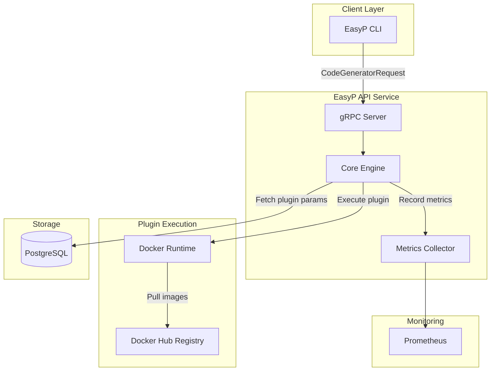
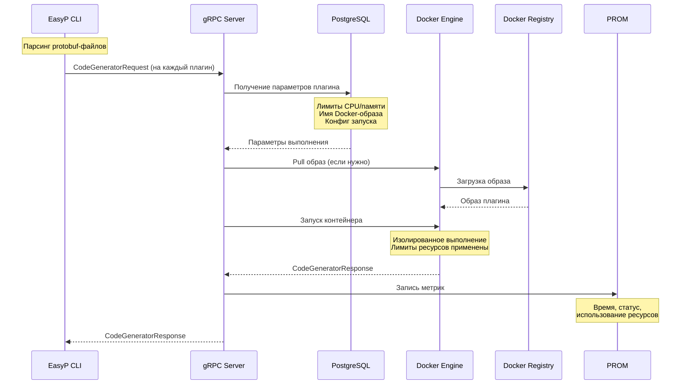

# Обзор API Service

**Централизованный сервис выполнения protobuf‑плагинов для консистентной изолированной генерации кода**

EasyP API Service устраняет хаос управления плагинами, предоставляя централизованный запуск protobuf/gRPC плагинов в изолированных Docker‑контейнерах. Он даёт единую платформу, позволяющую командам стандартизировать процесс генерации кода без операционных затрат на установку и поддержку плагинов на машинах разработчиков.

## Зачем нужен EasyP API Service?

### Проблема

Управление генерацией protobuf/gRPC кода в командах порождает существенную операционную сложность:

#### Несогласованность версий
- Разработчики локально используют разные версии плагинов → расхождения в генерированном коде и падения сборки
- Синдром «у меня работает» при различиях окружений
- Требуется ручная координация, чтобы вся команда была синхронизирована по версиям

#### Операционные накладные расходы
- DevOps тратят время на установку и обновление плагинов на рабочих станциях
- Новый разработчик — ручная настройка правильных версий
- Обновление плагинов требует коммуникации с каждым отдельно
- Нет централизованного контроля утверждённых версий

#### Риски безопасности и комплаенса
- Плагины ставятся из разных источников без валидации
- Нет аудита: какой плагин для какого билда использовался
- Сложно применять политики безопасности к инструментам генерации

### Решение: централизованный запуск плагинов

EasyP API Service решает эти проблемы за счёт централизованного управления:

| Проблема | Решение |
|----------|---------|
| **Контроль версий** | Мгновенное распространение новых версий через Docker‑образы |
| **Операции** | Команда эксплуатации управляет конфигурациями без доступа на машины разработчиков |
| **Безопасность** | Все плагины запускаются в изолированных контейнерах с ограничениями ресурсов |
| **Консистентность** | Единая среда выполнения вне зависимости от локальной установки |
| **Опыт разработчика** | Не нужно устанавливать и сопровождать плагины локально |

## Архитектура

Архитектура сервиса упрощена и сфокусирована на надёжном выполнении плагинов:



## Ключевые компоненты

### API Layer
- **gRPC Server** — основной API для запросов генерации
- Каждый запуск плагина — отдельный gRPC‑запрос
- Получает `CodeGeneratorRequest` от CLI

### Execution Engine
- **Docker Runtime** — изолированный запуск плагинов
- Подтягивает образы из публичных реестров (Docker Hub и т.п.)
- Применяет лимиты CPU/памяти на плагин

### Storage Layer
- **PostgreSQL** хранит параметры выполнения:
  - Ограничения ресурсов (CPU, память)
  - Конфигурацию и метаданные плагинов
  - Логи выполнения (аудит)
  - _Примечание: функциональность хранения будет расширяться_

### Monitoring
- **Prometheus** — сбор метрик
- Отслеживает время выполнения, успешность, использование ресурсов

## Как это работает

### Локальное выполнение (EasyP CLI)
При локальном запуске CLI поддерживает:
- **Installed plugins**: системно установленные protoc плагины
- **WASM plugins**: лёгкие WebAssembly плагины

### Удалённое выполнение (API Service)
При работе через сервис:
- **Только Docker**: плагины запускаются как контейнеры
- **Центральный контроль**: операционная команда управляет доступными версиями
- **Консистентная среда**: одинаковое окружение для всех разработчиков

## Поток выполнения плагина



### Шаги выполнения

1. **CLI Parsing**: CLI парсит локальные `.proto` файлы  
2. **Request Sending**: Отправляет `CodeGeneratorRequest` в API Service (по одному на плагин)  
3. **Parameter Lookup**: Сервис получает параметры запуска из PostgreSQL  
4. **Docker Execution**: Запускает плагин в изолированном контейнере  
5. **Metrics Recording**: Записывает метрики после завершения  
6. **Response**: Возвращает сгенерированный код обратно в CLI  

## Ключевые возможности

| Возможность | Описание |
|-------------|----------|
| **🐳 Изоляция плагинов** | Каждый плагин в отдельном безопасном контейнере |
| **⚙️ Контроль ресурсов** | Лимиты CPU и памяти на уровне контейнера |
| **📊 Метрики & мониторинг** | Полный набор Prometheus метрик |
| **🔄 Управление версиями** | Централизованно через Docker‑образы |
| **⚡ Простой протокол** | Стандарт `CodeGeneratorRequest/Response` |
| **🔒 Безопасность прежде всего** | Изоляция + ограниченные ресурсы |

## Конфигурация

Сервис настраивается через переменные окружения.

### Конфигурация сервера
```bash
EASYP_SERVICE_HOST=0.0.0.0
EASYP_SERVICE_GRPC_PORT=8080
```

### Конфигурация БД
```bash
EASYP_SERVICE_DB_HOST=localhost
EASYP_SERVICE_DB_PORT=5432
EASYP_SERVICE_DB_NAME=easyp_service
EASYP_SERVICE_DB_USER=easyp
EASYP_SERVICE_DB_PASSWORD=password
```

### Конфигурация Docker
```bash
# Docker socket для запуска контейнеров
DOCKER_HOST=unix:///var/run/docker.sock
```

## Хранение параметров плагинов

PostgreSQL хранит параметры выполнения для каждого плагина:

```sql
-- Пример конфигурации плагина
{
  "plugin_name": "protobuf/go:v1.36.10",
  "docker_image": "easyp/protoc-gen-go:v1.36.10",
  "resources": {
    "cpu_limit": "1.0",
    "memory_limit": "512MB"
  },
  "execution_config": {
    "timeout": "30s",
    "network": "none"
  }
}
```

::: tip
Схема хранения будет расширена — аудит логов, аналитика использования, кеширование плагинов.
:::

## Интеграция с EasyP CLI

Пример `easyp.yaml` для удалённого запуска:

```yaml
generate:
  plugins:
    # Удалённый запуск через API Service
    - remote: api.easyp.tech/protobuf/go:v1.36.10
      out: .
      opts:
        paths: source_relative
    
    - remote: api.easyp.tech/grpc/go:v1.5.1
      out: .
      opts:
        paths: source_relative
```

Запуск генерации:

```bash
easyp generate
```

CLI:
1. Парсит protobuf‑файлы
2. Отправляет отдельные запросы в сервис для каждого плагина
3. Получает ответы с кодом
4. Записывает файлы в указанные директории

## Доступные метрики

Метрики Prometheus:

| Метрика | Описание |
|---------|----------|
| `easyp_api_service_api_grpc_server_handled_total` | Общее число gRPC запросов по статусам |
| `easyp_api_service_api_grpc_server_handling_seconds` | Гистограмма задержек gRPC |
| `easyp_api_service_generated_plugin_code_total` | Выполнения плагинов по имени |
| `easyp_api_service_repo_call_duration_seconds` | Латентность запросов к БД |
| `easyp_api_service_repo_errors_total` | Количество ошибок доступа к БД |
| `easyp_api_service_standard_panics_total` | Число восстановленных паник |

## Характеристики производительности

| Показатель | Типичное значение | Примечания |
|-----------|-------------------|-----------|
| **Cold Start** | 2–5 сек | Первая загрузка образа |
| **Warm Start** | 100–500 мс | Образ закеширован |
| **Throughput** | 20–50 одновременных | Зависит от ресурсов |
| **Memory Usage** | 50–200 MB | На выполнение одного плагина |

## Безопасность

### Изоляция контейнеров
- Каждый плагин в отдельном эфемерном контейнере
- Нет сетевого доступа в процессе выполнения
- Лимиты CPU/памяти через Docker
- Контейнер удаляется после завершения

### Безопасность API
- gRPC транспорт
- Поддержка токенов аутентификации (в продакшн окружениях)
- Валидация входных данных
- Аудитные логи в PostgreSQL

## Продакшн‑аспекты

### Масштабирование
- **Горизонтальное**: несколько инстансов за балансировщиком
- **Ресурсы**: настройка лимитов для тяжёлых плагинов
- **База данных**: репликация PostgreSQL для отказоустойчивости

### Мониторинг
- **Метрики**: Prometheus
- **Алертинг**: оповещения на высокие ошибки/латентность
- **Логи**: структурированные для аудита и отладки

### План развития
Запланировано:
- Кеширование результатов генерации
- Расширенный аудит и аналитика использования
- Поддержка приватных реестров плагинов
- Более умное распределение ресурсов

## Сообщество и поддержка

- **💬 [Telegram чат](https://t.me/easyptech)** — обсуждения
- **🐛 [GitHub Issues](https://github.com/easyp-tech/service/issues)** — баги и запросы фич
- **📖 [Документация](https://easyp.tech)** — полный набор материалов

---

*Упростите свои protobuf‑воркфлоу с централизованным управлением выполнением плагинов.*